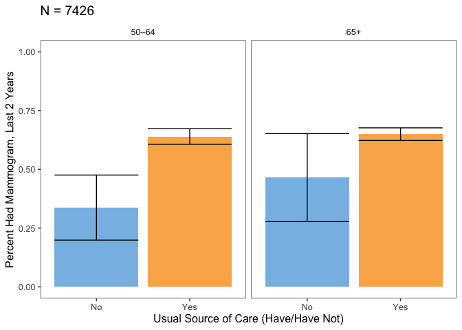
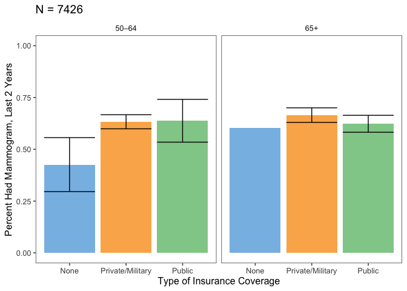
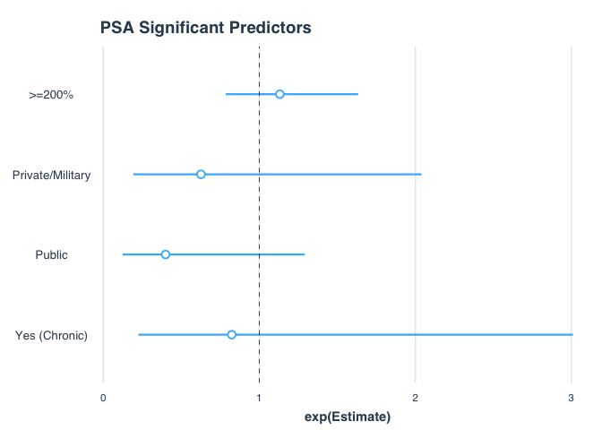

Final
================
Sijia Yue
11/24/2019

``` r
library(survey)
```

    ## Loading required package: grid

    ## Loading required package: Matrix

    ## Loading required package: survival

    ## 
    ## Attaching package: 'survey'

    ## The following object is masked from 'package:graphics':
    ## 
    ##     dotchart

``` r
library(tidyverse)
```

    ## ── Attaching packages ─────────────────────────────────────────────────────────────────── tidyverse 1.2.1 ──

    ## ✔ ggplot2 3.2.1     ✔ purrr   0.3.2
    ## ✔ tibble  2.1.3     ✔ dplyr   0.8.3
    ## ✔ tidyr   1.0.0     ✔ stringr 1.4.0
    ## ✔ readr   1.3.1     ✔ forcats 0.4.0

    ## ── Conflicts ────────────────────────────────────────────────────────────────────── tidyverse_conflicts() ──
    ## ✖ tidyr::expand() masks Matrix::expand()
    ## ✖ dplyr::filter() masks stats::filter()
    ## ✖ dplyr::lag()    masks stats::lag()
    ## ✖ tidyr::pack()   masks Matrix::pack()
    ## ✖ tidyr::unpack() masks Matrix::unpack()

``` r
library(jtools)
library(caret)
```

    ## Loading required package: lattice

    ## 
    ## Attaching package: 'caret'

    ## The following object is masked from 'package:purrr':
    ## 
    ##     lift

    ## The following object is masked from 'package:survival':
    ## 
    ##     cluster

``` r
library(leaps)
library(ggthemes)
library(MASS)
```

    ## 
    ## Attaching package: 'MASS'

    ## The following object is masked from 'package:dplyr':
    ## 
    ##     select

### Data Preparation

``` r
cancer_df = read_csv("cancerxx.csv") %>% 
  janitor::clean_names() %>% 
  dplyr::select(hhx, fmx, fpx, #identifiers
         wtfa_sa, #weights
         strat_p, psu_p, #for design
         region, 
         psahad, #ever has a psa test
         rpsa1_mt, #month of most recent psa test
         rpsa1n:psaexp)
```

    ## Parsed with column specification:
    ## cols(
    ##   .default = col_double(),
    ##   FPX = col_character(),
    ##   FMX = col_character(),
    ##   FN_AGE10 = col_logical(),
    ##   FN_AGE12 = col_logical(),
    ##   FN_AGE14 = col_logical(),
    ##   FN_AGE15 = col_logical(),
    ##   FN_AGE25 = col_logical(),
    ##   FN_AGE28 = col_logical(),
    ##   FN_AGE33 = col_logical(),
    ##   FN_MAN10 = col_logical(),
    ##   FN_MAN12 = col_logical(),
    ##   FN_MAN14 = col_logical(),
    ##   FN_MAN15 = col_logical(),
    ##   FN_MAN25 = col_logical(),
    ##   FN_MAN28 = col_logical(),
    ##   FN_MAN33 = col_logical(),
    ##   HHX = col_character()
    ## )

    ## See spec(...) for full column specifications.

    ## Warning: 227 parsing failures.
    ##  row      col           expected actual           file
    ## 5956 FN_AGE10 1/0/T/F/TRUE/FALSE      9 'cancerxx.csv'
    ## 5956 FN_AGE12 1/0/T/F/TRUE/FALSE      9 'cancerxx.csv'
    ## 5956 FN_AGE14 1/0/T/F/TRUE/FALSE      9 'cancerxx.csv'
    ## 5956 FN_AGE15 1/0/T/F/TRUE/FALSE      9 'cancerxx.csv'
    ## 5956 FN_AGE25 1/0/T/F/TRUE/FALSE      9 'cancerxx.csv'
    ## .... ........ .................. ...... ..............
    ## See problems(...) for more details.

``` r
fam_dat = read_csv("familyxx.csv") %>%
    janitor::clean_names() %>% 
    dplyr::select(hhx, fmx,  #identifiers
         rat_cat4, rat_cat5) # Ratio of family income to the poverty threshold (not sure the difference)
```

    ## Parsed with column specification:
    ## cols(
    ##   .default = col_double(),
    ##   FMX = col_character(),
    ##   HHX = col_character()
    ## )
    ## See spec(...) for full column specifications.

``` r
pers_dat = read_csv("personsx.csv") %>%
   janitor::clean_names() %>% 
    dplyr::select(hhx, fmx, fpx, #identifiers
         age_p, #age
         educ1, #education
         sex, #gender
         notcov, cover, cover65, cover65o,  #coverage > 65, 65+, alternate 65+
         la1ar, #limitation
         lcondrt, #limitation is chronic
         lachronr, #chronic limitation
         hiscodi3, #ethnicity recode,
         racreci3, #race recode
         yrsinus, #immigration status (for people not born in the US)
         plborn # place born
         )
```

    ## Parsed with column specification:
    ## cols(
    ##   .default = col_double(),
    ##   FPX = col_character(),
    ##   AGE_CHG = col_logical(),
    ##   FSPOUS2 = col_character(),
    ##   FCOHAB3 = col_character(),
    ##   FMX = col_character(),
    ##   HHREFLG = col_character(),
    ##   FMREFLG = col_character(),
    ##   FMRPFLG = col_character(),
    ##   FMOTHER1 = col_character(),
    ##   FFATHER1 = col_character(),
    ##   HHX = col_character(),
    ##   LCTIME5 = col_logical(),
    ##   LCUNIT5 = col_logical(),
    ##   LCTIME6 = col_logical(),
    ##   LCUNIT6 = col_logical(),
    ##   LCTIME10 = col_logical(),
    ##   LCUNIT10 = col_logical(),
    ##   LCTIME11 = col_logical(),
    ##   LCUNIT11 = col_logical(),
    ##   LCTIME90 = col_logical()
    ##   # ... with 68 more columns
    ## )
    ## See spec(...) for full column specifications.

    ## Warning: 2523 parsing failures.
    ##  row      col           expected actual           file
    ## 1265 LCTIME5  1/0/T/F/TRUE/FALSE     96 'personsx.csv'
    ## 1265 LCUNIT5  1/0/T/F/TRUE/FALSE     6  'personsx.csv'
    ## 1265 LCDURA5  1/0/T/F/TRUE/FALSE     10 'personsx.csv'
    ## 1265 LCDURB5  1/0/T/F/TRUE/FALSE     4  'personsx.csv'
    ## 1422 LAUNIT31 1/0/T/F/TRUE/FALSE     4  'personsx.csv'
    ## .... ........ .................. ...... ..............
    ## See problems(...) for more details.

``` r
adult_dat = read_csv("samadult.csv") %>%
   janitor::clean_names() %>% 
    dplyr::select(hhx, fmx, fpx, #identifiers
    ausualpl, ahcplrou, ahcplknd, #Usual source of care - different options
    fla1ar) #functional limitation
```

    ## Parsed with column specification:
    ## cols(
    ##   .default = col_double(),
    ##   FPX = col_character(),
    ##   FMX = col_character(),
    ##   HHX = col_character(),
    ##   CNKIND31 = col_logical(),
    ##   CANAGE2 = col_logical(),
    ##   CANAGE4 = col_logical(),
    ##   CANAGE8 = col_logical(),
    ##   CANAGE9 = col_logical(),
    ##   CANAGE13 = col_logical(),
    ##   CANAGE17 = col_logical(),
    ##   CANAGE19 = col_logical(),
    ##   CANAGE24 = col_logical(),
    ##   CANAGE25 = col_logical(),
    ##   CANAGE27 = col_logical(),
    ##   ALTIME26 = col_logical(),
    ##   ALTIME27 = col_logical(),
    ##   ALTIME29 = col_logical(),
    ##   ALTIME30 = col_logical(),
    ##   ALTIME34 = col_logical(),
    ##   ALUNIT26 = col_logical()
    ##   # ... with 24 more columns
    ## )
    ## See spec(...) for full column specifications.

    ## Warning: 650 parsing failures.
    ##  row      col           expected actual           file
    ## 1056 ALTIME34 1/0/T/F/TRUE/FALSE     6  'samadult.csv'
    ## 1056 ALUNIT34 1/0/T/F/TRUE/FALSE     3  'samadult.csv'
    ## 1056 ALDURB34 1/0/T/F/TRUE/FALSE     3  'samadult.csv'
    ## 1056 ALCHRC34 1/0/T/F/TRUE/FALSE     2  'samadult.csv'
    ## 1101 CANAGE24 1/0/T/F/TRUE/FALSE     35 'samadult.csv'
    ## .... ........ .................. ...... ..............
    ## See problems(...) for more details.

``` r
psa_df = cancer_df %>% 
  left_join(adult_dat, by = c("hhx", "fmx", "fpx")) %>% 
  left_join(pers_dat, by = c("hhx", "fmx", "fpx")) %>% 
  left_join(fam_dat, by = c("hhx", "fmx"))
head(psa_df)
```

    ## # A tibble: 6 x 38
    ##   hhx   fmx   fpx   wtfa_sa strat_p psu_p region psahad rpsa1_mt rpsa1n
    ##   <chr> <chr> <chr>   <dbl>   <dbl> <dbl>  <dbl>  <dbl>    <dbl>  <dbl>
    ## 1 0000… 01    01       7261     163     2      3     NA       NA     NA
    ## 2 0000… 01    01       5018     274     2      4     NA       NA     NA
    ## 3 0000… 01    01       2399     258     2      4      2       NA     NA
    ## 4 0000… 01    01       4077     184     1      3      2       NA     NA
    ## 5 0000… 01    01       2846      36     2      1     NA       NA     NA
    ## 6 0000… 01    02       9427     271     1      4     NA       NA     NA
    ## # … with 28 more variables: rpsa1t <dbl>, rpsa2 <dbl>, psareas <dbl>,
    ## #   psasugg <dbl>, psa5yr <dbl>, psaadv <dbl>, psadisav <dbl>,
    ## #   psaexp <dbl>, ausualpl <dbl>, ahcplrou <dbl>, ahcplknd <dbl>,
    ## #   fla1ar <dbl>, age_p <dbl>, educ1 <dbl>, sex <dbl>, notcov <dbl>,
    ## #   cover <dbl>, cover65 <dbl>, cover65o <dbl>, la1ar <dbl>,
    ## #   lcondrt <dbl>, lachronr <dbl>, hiscodi3 <dbl>, racreci3 <dbl>,
    ## #   yrsinus <dbl>, plborn <dbl>, rat_cat4 <dbl>, rat_cat5 <dbl>

### Data Manipulation

``` r
psa_df=psa_df %>% 
  mutate(educ_cat = case_when(educ1 < 13 ~ "Less than high school",
                              educ1 >= 13 & educ1 < 15 ~ "High school",
                              educ1 >= 15 & educ1 < 18 ~ "Some college",
                              educ1 >= 18 & educ1 <= 21 ~ "College graduate"))
```

``` r
psa_df=psa_df %>% 
  mutate(finc_cat = case_when(rat_cat5 <= 7 |  rat_cat5 %in% c(15, 16) ~ "<200%",
                              rat_cat5 %in% c(8, 9) ~ "200–299%", 
                              rat_cat5 %in% c(10, 11) ~ "300–399%",
                              rat_cat5 >= 18 & educ1 <= 21 ~ "400–499%",
                              rat_cat5 == 14  ~">=500%",
                              rat_cat5 == 17  ~">=200%, no further detail",
                              rat_cat5 %in% c(96, 99) ~ "Unknown"))
```

``` r
psa_df = psa_df %>% 
  mutate(ausualpl_cat  = case_when(ausualpl == 2 ~ "No",
                                 ausualpl %in% c(1, 3) ~ "Yes",
                                 ausualpl %in% c(7, 8, 9) ~ "Other"))
```

``` r
psa_df <- psa_df %>% 
  mutate(cover_cat  = case_when(notcov == 1 | cover == 4 | cover65 == 6 ~ "None",
                                cover == 2 | cover65 %in% 2:4 ~ "Public",
                                cover %in% c(1, 3) | cover65 %in% c(1, 5) ~ "Private/Military"))
```

``` r
psa_df <- psa_df %>% 
  mutate(lcond_chronic_cat = if_else(lcondrt == 1, "Yes", "No"))
```

``` r
psa_df <- psa_df %>% 
  mutate(race_cat = case_when(racreci3 == 1 ~ "White",
                              racreci3 == 2 ~ "Black",
                              racreci3 == 3 ~ "Asian",
                              racreci3 == 4 ~ "AN/AI"),
         eth_cat = case_when(hiscodi3 == 1 ~ "Hispanic",
                             hiscodi3 == 2 ~ "Non-Hispanic White",
                             hiscodi3 == 3 ~ "Non-Hispanic Black",
                             hiscodi3 == 4 ~ "Non-Hispanic Asian",
                             hiscodi3 == 5 ~ "Non-Hispanic AN/AI"),
         yrus_cat = case_when(yrsinus < 4 ~ "In U.S. < 10 yrs",
                              yrsinus == 4 | yrsinus == 5 ~ "In U.S. >= 10 yrs",
                              plborn == 1 ~ "Born in U.S.")) %>% 
    mutate_at(vars(psaadv, psadisav, psaexp, psasugg), ~factor(.x))
```

``` r
psa_df =
  psa_df %>%
  # create domain variable for inclusion criteria
  mutate(domain = if_else(sex == 1 & age_p >= 50, 1,0),
         age_cat = case_when(age_p >= 50 & age_p < 65 ~ "50–64",
                              age_p >= 65 ~ "65+"),
         imm_stat = case_when(yrsinus < 4 ~ "In U.S. < 10 yrs",
                              yrsinus == 4 | yrsinus == 5 ~ "In U.S. >= 10 yrs",
                              plborn == 1 ~ "Born in U.S.")) 
```

### Survey design

Domain analysis: add indicationg variable into the by function.

``` r
psa_df %>% count(rpsa1_mt)
```

    ## # A tibble: 16 x 2
    ##    rpsa1_mt     n
    ##       <dbl> <int>
    ##  1        1   249
    ##  2        2   243
    ##  3        3   218
    ##  4        4   240
    ##  5        5   206
    ##  6        6   266
    ##  7        7   211
    ##  8        8   176
    ##  9        9   211
    ## 10       10   269
    ## 11       11   221
    ## 12       12   183
    ## 13       96  1194
    ## 14       97     5
    ## 15       99   520
    ## 16       NA 29260

``` r
psa_df = 
  psa_df %>% 
  mutate(psa_1yr = case_when(rpsa1_mt %in% c(1:12) ~ 1,
                             rpsa1_mt %in% c(96,97,99) ~ 0)) %>% 
  filter(strat_p != 70)

psa_df %>% 
  filter(domain==1) %>% 
  summarise(n())
```

    ## # A tibble: 1 x 1
    ##   `n()`
    ##   <int>
    ## 1  7426

``` r
des = svydesign(ids = ~psu_p, strata = ~strat_p, weights = ~wtfa_sa, nest = TRUE, data = psa_df)
```

### Tables

``` r
# percent of men who have had PSA in the last two years by age
age_pct = svyby(~psa_1yr, by = ~domain+age_cat, svymean, na.rm = TRUE, 
                design = des, vartype = c("ci", "se"))
age_pct %>% filter(domain == 1) %>% dplyr::select(-domain, -se) %>% knitr::kable()
```

| age\_cat |   psa\_1yr|      ci\_l|      ci\_u|
|:---------|----------:|----------:|----------:|
| 50–64    |  0.6224328|  0.5900152|  0.6548505|
| 65+      |  0.6463407|  0.6197358|  0.6729456|

``` r
# percent of men who have had PSA by education
edu_pct = svyby(~psa_1yr, by = ~domain+educ_cat, svymean, na.rm = TRUE, 
                design = des, vartype = c("se", "ci")) %>%
  filter(domain == 1) %>%
  dplyr::select(-domain, -se)
edu_counts = filter(psa_df, domain == 1) %>%
  group_by(educ_cat) %>%
  summarise(count = n())
edu_pct = left_join(edu_pct, edu_counts, by = "educ_cat")
edu_pct %>% 
  knitr::kable()
```

| educ\_cat             |   psa\_1yr|      ci\_l|      ci\_u|  count|
|:----------------------|----------:|----------:|----------:|------:|
| College graduate      |  0.6539778|  0.6198052|  0.6881505|   2216|
| High school           |  0.6370220|  0.5946618|  0.6793821|   1992|
| Less than high school |  0.5636584|  0.5019121|  0.6254047|   1156|
| Some college          |  0.6297547|  0.5899282|  0.6695812|   2030|

``` r
# percent of men who have had PSA by financial category
finc_pct = svyby(~psa_1yr, by = ~domain+finc_cat, svymean, na.rm = TRUE, 
                 design = des, vartype = c("se", "ci")) %>%
  filter(domain == 1) %>%
  dplyr::select(-domain, -se)
finc_counts = filter(psa_df, domain == 1) %>%
  group_by(finc_cat) %>%
  summarise(count = n())
finc_pct = left_join(finc_pct, finc_counts, by = "finc_cat")
finc_pct %>% knitr::kable()
```

| finc\_cat                    |   psa\_1yr|       ci\_l|      ci\_u|  count|
|:-----------------------------|----------:|-----------:|----------:|------:|
| &lt;200%                     |  0.5937589|   0.5473731|  0.6401448|   2088|
| &gt;=200%, no further detail |  0.5487450|   0.4294939|  0.6679960|    219|
| &gt;=500%                    |  0.6812168|   0.6490487|  0.7133850|   1828|
| 200–299%                     |  0.6147405|   0.5540045|  0.6754765|    980|
| 300–399%                     |  0.5862492|   0.5221590|  0.6503395|    775|
| 400–499%                     |  0.6048691|   0.5464290|  0.6633092|    890|
| Unknown                      |  0.6326029|  -0.0116109|  1.2768166|     10|

``` r
# percent of men who have had PSA by usual care category
ausualp_pct = svyby(~psa_1yr, by = ~domain+ausualpl_cat, svymean, na.rm = TRUE, 
                    design = des, vartype = c("se", "ci")) %>%
  filter(domain == 1) %>%
  dplyr::select(-domain, -se)
usual_counts = filter(psa_df, domain == 1) %>%
  group_by(ausualpl_cat) %>%
  summarise(count = n())
ausualp_pct = left_join(ausualp_pct, usual_counts, by = "ausualpl_cat")
ausualp_pct %>% knitr::kable()
```

| ausualpl\_cat |   psa\_1yr|      ci\_l|      ci\_u|  count|
|:--------------|----------:|----------:|----------:|------:|
| No            |  0.3667691|  0.2456204|  0.4879178|    638|
| Other         |  1.0000000|  1.0000000|  1.0000000|     52|
| Yes           |  0.6446701|  0.6219734|  0.6673668|   6736|

``` r
# percent of men who have had PSA by health coverage
cover_pct = svyby(~psa_1yr, by = ~domain+cover_cat, svymean, na.rm = TRUE, 
                  design = des, vartype = c("se", "ci")) %>%
  filter(domain == 1) %>%
  dplyr::select(-domain, -se)
cover_counts = filter(psa_df, domain == 1) %>%
  group_by(cover_cat) %>%
  summarise(count = n())
cover_pct = left_join(cover_pct, cover_counts, by = "cover_cat")
cover_pct %>% knitr::kable()
```

| cover\_cat       |   psa\_1yr|      ci\_l|      ci\_u|  count|
|:-----------------|----------:|----------:|----------:|------:|
| None             |  0.4314935|  0.3042176|  0.5587694|    444|
| Private/Military |  0.6453476|  0.6193451|  0.6713500|   4891|
| Public           |  0.6251792|  0.5860165|  0.6643418|   2066|

``` r
# percent of men who have had PSA by chronic conditions
lcond_chronic_pct = svyby(~psa_1yr, by = ~domain+lcond_chronic_cat, svymean, 
                          na.rm = TRUE, design = des, vartype = c("se", "ci")) %>%
  filter(domain == 1) %>%
  dplyr::select(-domain, -se)
chronic_counts = filter(psa_df, domain == 1) %>%
  group_by(lcond_chronic_cat) %>%
  summarise(count = n())
lcond_chronic_pct = left_join(lcond_chronic_pct, chronic_counts, by = "lcond_chronic_cat")
lcond_chronic_pct %>% knitr::kable()
```

| lcond\_chronic\_cat |   psa\_1yr|      ci\_l|      ci\_u|  count|
|:--------------------|----------:|----------:|----------:|------:|
| No                  |  0.6667540|  0.3825088|  0.9509992|     42|
| Yes                 |  0.5842896|  0.5456966|  0.6228826|   2054|

``` r
# percent of men who have had PSA by race
race_pct = svyby(~psa_1yr, by = ~domain+race_cat, svymean, na.rm = TRUE, 
                 design = des, vartype = c("se", "ci")) %>%
  filter(domain == 1) %>%
  dplyr::select(-domain, -se)
race_counts = filter(psa_df, domain == 1) %>%
  group_by(race_cat) %>%
  summarise(count = n())
race_pct = left_join(race_pct, race_counts, by = "race_cat")
race_pct %>% knitr::kable()
```

| race\_cat |   psa\_1yr|      ci\_l|      ci\_u|  count|
|:----------|----------:|----------:|----------:|------:|
| AN/AI     |  0.5703481|  0.3661996|  0.7744966|    117|
| Asian     |  0.5781548|  0.4705201|  0.6857895|    346|
| Black     |  0.6218680|  0.5616538|  0.6820822|    939|
| White     |  0.6381260|  0.6139418|  0.6623101|   6024|

``` r
# percent of men who have had PSA by ethnicity
eth_pct = svyby(~psa_1yr, by = ~domain+eth_cat, svymean, na.rm = TRUE, 
                design = des, vartype = c("se", "ci")) %>%
  filter(domain == 1) %>%
  dplyr::select(-domain, -se)
eth_counts = filter(psa_df, domain == 1) %>%
  group_by(eth_cat) %>%
  summarise(count = n())
eth_pct = left_join(eth_pct, eth_counts, by = "eth_cat")
eth_pct %>% knitr::kable()
```

| eth\_cat           |   psa\_1yr|      ci\_l|      ci\_u|  count|
|:-------------------|----------:|----------:|----------:|------:|
| Hispanic           |  0.6166346|  0.5504883|  0.6827809|    787|
| Non-Hispanic AN/AI |  0.6567017|  0.4352398|  0.8781637|     91|
| Non-Hispanic Asian |  0.5644709|  0.4505698|  0.6783720|    327|
| Non-Hispanic Black |  0.6122470|  0.5504867|  0.6740073|    915|
| Non-Hispanic White |  0.6404032|  0.6149000|  0.6659064|   5306|

``` r
# percent of men who have had PSA by immigration status
imm_pct = svyby(~psa_1yr, by = ~domain+imm_stat, svymean, na.rm = TRUE,
                design = des, vartype = c("se", "ci")) %>%
  filter(domain == 1) %>%
  dplyr::select(-domain, -se)
imm_counts = filter(psa_df, domain == 1) %>%
  group_by(imm_stat) %>%
  summarise(count = n())
imm_pct = left_join(imm_pct, imm_counts, by = "imm_stat")
imm_pct %>% knitr::kable()
```

| imm\_stat            |   psa\_1yr|      ci\_l|      ci\_u|  count|
|:---------------------|----------:|----------:|----------:|------:|
| Born in U.S.         |  0.6346068|  0.6110529|  0.6581607|   6333|
| In U.S. &lt; 10 yrs  |  0.7110240|  0.4396774|  0.9823706|     59|
| In U.S. &gt;= 10 yrs |  0.6343739|  0.5720940|  0.6966537|   1015|

Tables By Age Group

``` r
# percent of men who have had PSA by education and age 
edu_pct_strat = svyby(~psa_1yr, by = ~domain + age_cat + educ_cat, svymean, 
                      na.rm = TRUE, design = des, vartype = c("se", "ci"))
edu_tab = edu_pct_strat %>% 
  filter(domain == 1) %>% 
  dplyr::select(-domain, -se) 
edu_counts2 = filter(psa_df, domain == 1) %>%
  group_by(age_cat, educ_cat) %>%
  summarise(count = n())
edu_tab = left_join(edu_tab, edu_counts2, by = c("age_cat", "educ_cat"))
edu_tab %>% knitr::kable()
```

| age\_cat | educ\_cat             |   psa\_1yr|      ci\_l|      ci\_u|  count|
|:---------|:----------------------|----------:|----------:|----------:|------:|
| 50–64    | College graduate      |  0.6220590|  0.5740531|  0.6700649|   1165|
| 65+      | College graduate      |  0.6897178|  0.6484398|  0.7309958|   1051|
| 50–64    | High school           |  0.5965755|  0.5252246|  0.6679264|   1086|
| 65+      | High school           |  0.6734629|  0.6261951|  0.7207308|    906|
| 50–64    | Less than high school |  0.5998807|  0.4846838|  0.7150776|    515|
| 65+      | Less than high school |  0.5391163|  0.4689640|  0.6092687|    641|
| 50–64    | Some college          |  0.6486446|  0.5924599|  0.7048292|   1176|
| 65+      | Some college          |  0.6086206|  0.5503354|  0.6669059|    854|

``` r
# percent of men who have had PSA by financial category and age
finc_pct_strat = svyby(~psa_1yr, by = ~domain + age_cat + finc_cat, svymean, 
                       na.rm = TRUE, design = des, vartype = c("se", "ci"))
finc_tab = finc_pct_strat %>% 
  filter(domain == 1) %>% 
  dplyr::select(-domain, -se) 
finc_counts2 = filter(psa_df, domain == 1) %>%
  group_by(age_cat, finc_cat) %>%
  summarise(count = n())
finc_tab = left_join(finc_tab, finc_counts2, by = c("age_cat", "finc_cat"))
finc_tab %>% knitr::kable()
```

| age\_cat | finc\_cat                    |   psa\_1yr|      ci\_l|      ci\_u|  count|
|:---------|:-----------------------------|----------:|----------:|----------:|------:|
| 50–64    | &lt;200%                     |  0.5960212|  0.5276983|  0.6643441|   1160|
| 65+      | &lt;200%                     |  0.5914655|  0.5279687|  0.6549622|    928|
| 50–64    | &gt;=200%, no further detail |  0.5469473|  0.3216557|  0.7722388|     81|
| 65+      | &gt;=200%, no further detail |  0.5495356|  0.4176490|  0.6814221|    138|
| 50–64    | &gt;=500%                    |  0.6454720|  0.6009265|  0.6900175|   1130|
| 65+      | &gt;=500%                    |  0.7339579|  0.6914227|  0.7764931|    698|
| 50–64    | 200–299%                     |  0.6616265|  0.5469771|  0.7762759|    425|
| 65+      | 200–299%                     |  0.5825825|  0.5150454|  0.6501195|    555|
| 50–64    | 300–399%                     |  0.4918107|  0.3867818|  0.5968397|    399|
| 65+      | 300–399%                     |  0.6585750|  0.5852877|  0.7318623|    376|
| 50–64    | 400–499%                     |  0.6125775|  0.5175935|  0.7075614|    397|
| 65+      | 400–499%                     |  0.5993411|  0.5309175|  0.6677646|    493|
| 50–64    | Unknown                      |  1.0000000|  1.0000000|  1.0000000|      5|
| 65+      | Unknown                      |  0.0000000|  0.0000000|  0.0000000|      5|

``` r
# percent of men who have had PSA by usual care and age
ausualp_pct_strat = svyby(~psa_1yr, by = ~domain + age_cat + ausualpl_cat,
                          svymean, na.rm = TRUE, design = des, 
                          vartype = c("se", "ci"))
usual_tab = ausualp_pct_strat %>% 
  filter(domain == 1) %>% 
  dplyr::select(-domain, -se) 
usual_counts2 = filter(psa_df, domain == 1) %>%
  group_by(age_cat, ausualpl_cat) %>%
  summarise(count = n())
usual_tab = left_join(usual_tab, usual_counts2, by = c("age_cat", "ausualpl_cat"))
usual_tab %>% knitr::kable()
```

| age\_cat | ausualpl\_cat |   psa\_1yr|      ci\_l|      ci\_u|  count|
|:---------|:--------------|----------:|----------:|----------:|------:|
| 50–64    | No            |  0.3371015|  0.1986653|  0.4755376|    482|
| 65+      | No            |  0.4646195|  0.2773024|  0.6519366|    156|
| 50–64    | Other         |  0.0000000|  0.0000000|  0.0000000|     28|
| 65+      | Other         |  1.0000000|  1.0000000|  1.0000000|     24|
| 50–64    | Yes           |  0.6396488|  0.6065159|  0.6727817|   3447|
| 65+      | Yes           |  0.6495615|  0.6226073|  0.6765157|   3289|

``` r
# percent of men who have had PSA by health coverage and age
cover_pct_strat = svyby(~psa_1yr, by = ~domain + age_cat + cover_cat, svymean,
                        na.rm = TRUE, design = des, vartype = c("se", "ci"))
ins_tab = cover_pct_strat %>% 
  filter(domain == 1) %>% 
  dplyr::select(-domain, -se)
ins_counts2 = filter(psa_df, domain == 1) %>%
  group_by(age_cat, cover_cat) %>%
  summarise(count = n())
ins_tab = left_join(ins_tab, ins_counts2, by = c("age_cat", "cover_cat"))
ins_tab %>% knitr::kable()
```

| age\_cat | cover\_cat       |   psa\_1yr|      ci\_l|      ci\_u|  count|
|:---------|:-----------------|----------:|----------:|----------:|------:|
| 50–64    | None             |  0.4261227|  0.2957721|  0.5564733|    422|
| 65+      | None             |  0.6039433|  0.1751150|  1.0327716|     22|
| 50–64    | Private/Military |  0.6328812|  0.5989424|  0.6668200|   3042|
| 65+      | Private/Military |  0.6650912|  0.6300084|  0.7001740|   1849|
| 50–64    | Public           |  0.6378134|  0.5345046|  0.7411223|    472|
| 65+      | Public           |  0.6232189|  0.5823667|  0.6640711|   1594|

``` r
# percent of men who have had PSA by chronic conditions and age
lcond_chronic_pct_strat = svyby(~psa_1yr, 
                                by = ~domain + age_cat + lcond_chronic_cat,
                                svymean, na.rm = TRUE, design = des,
                                vartype = c("se", "ci"))
dis_tab = lcond_chronic_pct_strat %>% 
  filter(domain == 1) %>% 
  dplyr::select(-domain, -se)
dis_counts2 = filter(psa_df, domain == 1) %>%
  group_by(age_cat, lcond_chronic_cat) %>%
  summarise(count = n())
dis_tab = left_join(dis_tab, dis_counts2, by = c("age_cat", "lcond_chronic_cat"))
dis_tab %>% knitr::kable()
```

| age\_cat | lcond\_chronic\_cat |   psa\_1yr|      ci\_l|      ci\_u|  count|
|:---------|:--------------------|----------:|----------:|----------:|------:|
| 50–64    | No                  |  0.6556569|  0.2607484|  1.0505654|     21|
| 65+      | No                  |  0.6724408|  0.2938361|  1.0510456|     21|
| 50–64    | Yes                 |  0.6357627|  0.5738309|  0.6976945|    917|
| 65+      | Yes                 |  0.5474168|  0.4994789|  0.5953546|   1137|

``` r
# percent of men who have had PSA by race and age
race_pct_strat = svyby(~psa_1yr, by = ~domain + age_cat + race_cat, svymean, 
                       na.rm = TRUE, design = des, vartype = c("se", "ci"))
race_tab = race_pct_strat %>% 
  filter(domain == 1) %>% 
  dplyr::select(-domain, -se) 
race_counts2 = filter(psa_df, domain == 1) %>%
  group_by(age_cat, race_cat) %>%
  summarise(count = n())
race_tab = left_join(race_tab, race_counts2, by = c("age_cat", "race_cat"))
race_tab %>% knitr::kable()
```

| age\_cat | race\_cat |   psa\_1yr|      ci\_l|      ci\_u|  count|
|:---------|:----------|----------:|----------:|----------:|------:|
| 50–64    | AN/AI     |  0.5647422|  0.2879002|  0.8415842|     74|
| 65+      | AN/AI     |  0.5799006|  0.3034607|  0.8563405|     43|
| 50–64    | Asian     |  0.6663906|  0.5035825|  0.8291988|    207|
| 65+      | Asian     |  0.4967146|  0.3524212|  0.6410079|    139|
| 50–64    | Black     |  0.6066064|  0.5241156|  0.6890973|    551|
| 65+      | Black     |  0.6464544|  0.5736276|  0.7192812|    388|
| 50–64    | White     |  0.6241212|  0.5886853|  0.6595570|   3125|
| 65+      | White     |  0.6516333|  0.6235150|  0.6797516|   2899|

``` r
# percent of men who have had PSA by ethnicity and age
eth_pct_strat = svyby(~psa_1yr, by = ~domain + age_cat + eth_cat, svymean, 
                      na.rm = TRUE, design = des, vartype = c("se", "ci"))
eth_tab = eth_pct_strat %>% 
  filter(domain == 1) %>% 
  dplyr::select(-domain, -se) 
eth_counts2 = filter(psa_df, domain == 1) %>%
  group_by(age_cat, eth_cat) %>%
  summarise(count = n())
eth_tab = left_join(eth_tab, eth_counts2, by = c("age_cat", "eth_cat"))
eth_tab %>% knitr::kable()
```

| age\_cat | eth\_cat           |   psa\_1yr|      ci\_l|      ci\_u|  count|
|:---------|:-------------------|----------:|----------:|----------:|------:|
| 50–64    | Hispanic           |  0.6086124|  0.5177032|  0.6995215|    482|
| 65+      | Hispanic           |  0.6272817|  0.5387642|  0.7157991|    305|
| 50–64    | Non-Hispanic AN/AI |  0.6942218|  0.4033836|  0.9850600|     57|
| 65+      | Non-Hispanic AN/AI |  0.6099224|  0.2850651|  0.9347797|     34|
| 50–64    | Non-Hispanic Asian |  0.6490843|  0.4769214|  0.8212471|    193|
| 65+      | Non-Hispanic Asian |  0.4868300|  0.3351777|  0.6384824|    134|
| 50–64    | Non-Hispanic Black |  0.5925232|  0.5075041|  0.6775424|    535|
| 65+      | Non-Hispanic Black |  0.6434586|  0.5700074|  0.7169098|    380|
| 50–64    | Non-Hispanic White |  0.6265678|  0.5883826|  0.6647531|   2690|
| 65+      | Non-Hispanic White |  0.6534663|  0.6243060|  0.6826267|   2616|

``` r
# percent of men who have had PSA by immigration and age
imm_pct_strat = svyby(~psa_1yr, by = ~domain + age_cat + imm_stat, svymean,
                      na.rm = TRUE, design = des, vartype = c("se", "ci"))
imm_tab = imm_pct_strat %>%
  filter(domain == 1) %>%
  dplyr::select(-domain, -se)
imm_counts2 = filter(psa_df, domain == 1) %>%
  group_by(age_cat, imm_stat) %>%
  summarise(count = n())
imm_tab = left_join(imm_tab, imm_counts2, by = c("age_cat", "imm_stat"))
imm_tab %>% knitr::kable()
```

| age\_cat | imm\_stat            |   psa\_1yr|      ci\_l|      ci\_u|  count|
|:---------|:---------------------|----------:|----------:|----------:|------:|
| 50–64    | Born in U.S.         |  0.6192308|  0.5845663|  0.6538953|   3296|
| 65+      | Born in U.S.         |  0.6498948|  0.6222548|  0.6775347|   3037|
| 50–64    | In U.S. &lt; 10 yrs  |  0.5979893|  0.2750415|  0.9209371|     42|
| 65+      | In U.S. &lt; 10 yrs  |  1.0000000|  1.0000000|  1.0000000|     17|
| 50–64    | In U.S. &gt;= 10 yrs |  0.6509079|  0.5685419|  0.7332739|    609|
| 65+      | In U.S. &gt;= 10 yrs |  0.6152194|  0.5325689|  0.6978700|    406|

``` r
# overall percent of men who have had PSA
total = svyby(~psa_1yr, by = ~domain + age_cat, svymean, na.rm = TRUE, 
              design = des, vartype = c("se", "ci"))
tot_tab = total %>% 
  filter(domain == 1) %>% 
  dplyr::select(-domain, -se) 
tot_counts = filter(psa_df, domain == 1) %>%
  group_by(age_cat) %>%
  summarise(count = n())
tot_tab = left_join(tot_tab, tot_counts, by = "age_cat")
tot_tab %>% knitr::kable()
```

| age\_cat |   psa\_1yr|      ci\_l|      ci\_u|  count|
|:---------|----------:|----------:|----------:|------:|
| 50–64    |  0.6224328|  0.5900152|  0.6548505|   3957|
| 65+      |  0.6463407|  0.6197358|  0.6729456|   3469|

``` r
all_counts = filter(psa_df, domain == 1)
tot_pct = svyby(~psa_1yr, by = ~domain, svymean, na.rm = TRUE, design = des,
                vartype = c("se", "ci")) %>%
  filter(domain == 1) %>%
  dplyr::select(-domain, -se) %>%
  mutate(age_cat = "50+",
         count = 7426)
```

Combine into paper table

``` r
# COMBINE TABLES BY AGE WITH TABLES OVERALL
# overall
tot_tab = rbind(tot_pct, tot_tab)
tot_tab2 = tot_tab %>%
  mutate(type = "Total",
         level = "-")
# education
edu_pct2 = edu_pct %>%
  mutate(age_cat = "50+")
edu_tab = rbind(edu_pct2, edu_tab)
# factor levels for presentation
edu_tab2 = edu_tab %>%
  mutate(type = "Education") %>%
  rename(level = educ_cat) %>%
  mutate(level = factor(level, levels = c("Less than high school", "High school", "Some college", "College graduate"))) %>%
  arrange(level)
# financial category
finc_pct2 = finc_pct %>%
  mutate(age_cat = "50+")
finc_tab = rbind(finc_pct2, finc_tab)
# factor levels for presentation
finc_tab2 = finc_tab %>%
  mutate(type = "Family Income Poverty Ratio") %>%
  rename(level = finc_cat) %>%
  mutate(level = factor(level, levels = c("<200%", ">=200%, no further detail", "200–299%", "300–399%", "400–499%", ">=500%", "Unknown"))) %>%
  arrange(level)
# usual care category
ausualp_pct2 = ausualp_pct %>%
  mutate(age_cat = "50+")
usual_tab = rbind(ausualp_pct2, usual_tab)
# factor levels for presentation
usual_tab2 = usual_tab %>%
  mutate(type = "Usual Source of Care") %>%
  rename(level = ausualpl_cat) %>%
  mutate(level = factor(level, levels = c("No", "Yes", "Other"))) %>%
  arrange(level)
# insurance coverage category
cover_pct2 = cover_pct %>%
  mutate(age_cat = "50+")
ins_tab = rbind(cover_pct2, ins_tab)
# factor levels for presentation
ins_tab2 = ins_tab %>%
  mutate(type = "Insurance Type") %>%
  rename(level = cover_cat) %>%
  mutate(level = factor(level, levels = c("None", "Public", "Private/Military"))) %>%
  arrange(level)
# chronic condition category
lcond_chronic_pct2 = lcond_chronic_pct %>%
  mutate(age_cat = "50+")
dis_tab = rbind(lcond_chronic_pct2, dis_tab)
# factor levels for presentation
dis_tab2 = dis_tab %>%
  mutate(type = "Chronic Disability") %>%
  rename(level = lcond_chronic_cat) %>%
  mutate(level = factor(level, levels = c("Yes", "No"))) %>%
  arrange(level)
# ethnic category
eth_pct2 = eth_pct %>%
  mutate(age_cat = "50+")
eth_tab = rbind(eth_pct2, eth_tab)
# factor levels for presentation
eth_tab2 = eth_tab %>%
  mutate(type = "Ethnicity") %>%
  rename(level = eth_cat) %>%
  mutate(level = factor(level, levels = c("Hispanic", "Non-Hispanic White", "Non-Hispanic Black", "Non-Hispanic AN/AI", "Non-Hispanic Asian"))) %>%
  arrange(level)
# race category
race_pct2 = race_pct %>%
  mutate(age_cat = "50+")
race_tab = rbind(race_pct2, race_tab)
# factor levels for presentation
race_tab2 = race_tab %>%
  mutate(type = "Race") %>%
  rename(level = race_cat) %>%
  mutate(level = factor(level, levels = c("White", "Black", "AN/AI", "Asian"))) %>%
  arrange(level)
# immigration category
imm_pct2 = imm_pct %>%
  mutate(age_cat = "50+")
imm_tab = rbind(imm_pct2, imm_tab)
# factor levels for presentation
imm_tab2 = imm_tab %>%
  mutate(type = "Immigration") %>%
  rename(level = imm_stat) %>%
  mutate(level = factor(level, levels = c("In U.S. < 10 yrs", "In U.S. >= 10 yrs", "Born in U.S."))) %>%
  arrange(level)
# create table of percentages of women who have gotten mammograms within the last two years (still need to add CIs)
tab_one = rbind(tot_tab2, edu_tab2, finc_tab2, usual_tab2, ins_tab2, dis_tab2, eth_tab2, race_tab2, imm_tab2) %>%
  mutate(psa_1yr = round(psa_1yr*100, 1),
         ci_l = round(ci_l*100, 1),
         ci_u = round(ci_u*100, 1),
         CI = str_c(ci_l, ", ", ci_u)) %>%
  rename(Percent = psa_1yr,
         N = count) %>%
  dplyr::select(-ci_l, -ci_u) %>%
  pivot_wider(names_from = age_cat, values_from = c(N, Percent, CI)) %>%
  janitor::clean_names() %>% 
  dplyr::select(type, level, n_50, percent_50, ci_50, n_50_64, percent_50_64, ci_50_64, n_65, percent_65, ci_65, everything())
# print percentages
tab_one %>% knitr::kable()
```

| type                        | level                        |  n\_50|  percent\_50| ci\_50      |  n\_50\_64|  percent\_50\_64| ci\_50\_64  |  n\_65|  percent\_65| ci\_65      |
|:----------------------------|:-----------------------------|------:|------------:|:------------|----------:|----------------:|:------------|------:|------------:|:------------|
| Total                       | -                            |   7426|         63.4| 61.2, 65.7  |       3957|             62.2| 59, 65.5    |   3469|         64.6| 62, 67.3    |
| Education                   | Less than high school        |   1156|         56.4| 50.2, 62.5  |        515|             60.0| 48.5, 71.5  |    641|         53.9| 46.9, 60.9  |
| Education                   | High school                  |   1992|         63.7| 59.5, 67.9  |       1086|             59.7| 52.5, 66.8  |    906|         67.3| 62.6, 72.1  |
| Education                   | Some college                 |   2030|         63.0| 59, 67      |       1176|             64.9| 59.2, 70.5  |    854|         60.9| 55, 66.7    |
| Education                   | College graduate             |   2216|         65.4| 62, 68.8    |       1165|             62.2| 57.4, 67    |   1051|         69.0| 64.8, 73.1  |
| Family Income Poverty Ratio | &lt;200%                     |   2088|         59.4| 54.7, 64    |       1160|             59.6| 52.8, 66.4  |    928|         59.1| 52.8, 65.5  |
| Family Income Poverty Ratio | &gt;=200%, no further detail |    219|         54.9| 42.9, 66.8  |         81|             54.7| 32.2, 77.2  |    138|         55.0| 41.8, 68.1  |
| Family Income Poverty Ratio | 200–299%                     |    980|         61.5| 55.4, 67.5  |        425|             66.2| 54.7, 77.6  |    555|         58.3| 51.5, 65    |
| Family Income Poverty Ratio | 300–399%                     |    775|         58.6| 52.2, 65    |        399|             49.2| 38.7, 59.7  |    376|         65.9| 58.5, 73.2  |
| Family Income Poverty Ratio | 400–499%                     |    890|         60.5| 54.6, 66.3  |        397|             61.3| 51.8, 70.8  |    493|         59.9| 53.1, 66.8  |
| Family Income Poverty Ratio | &gt;=500%                    |   1828|         68.1| 64.9, 71.3  |       1130|             64.5| 60.1, 69    |    698|         73.4| 69.1, 77.6  |
| Family Income Poverty Ratio | Unknown                      |     10|         63.3| -1.2, 127.7 |          5|            100.0| 100, 100    |      5|          0.0| 0, 0        |
| Usual Source of Care        | No                           |    638|         36.7| 24.6, 48.8  |        482|             33.7| 19.9, 47.6  |    156|         46.5| 27.7, 65.2  |
| Usual Source of Care        | Yes                          |   6736|         64.5| 62.2, 66.7  |       3447|             64.0| 60.7, 67.3  |   3289|         65.0| 62.3, 67.7  |
| Usual Source of Care        | Other                        |     52|        100.0| 100, 100    |         28|              0.0| 0, 0        |     24|        100.0| 100, 100    |
| Insurance Type              | None                         |    444|         43.1| 30.4, 55.9  |        422|             42.6| 29.6, 55.6  |     22|         60.4| 17.5, 103.3 |
| Insurance Type              | Public                       |   2066|         62.5| 58.6, 66.4  |        472|             63.8| 53.5, 74.1  |   1594|         62.3| 58.2, 66.4  |
| Insurance Type              | Private/Military             |   4891|         64.5| 61.9, 67.1  |       3042|             63.3| 59.9, 66.7  |   1849|         66.5| 63, 70      |
| Chronic Disability          | Yes                          |   2054|         58.4| 54.6, 62.3  |        917|             63.6| 57.4, 69.8  |   1137|         54.7| 49.9, 59.5  |
| Chronic Disability          | No                           |     42|         66.7| 38.3, 95.1  |         21|             65.6| 26.1, 105.1 |     21|         67.2| 29.4, 105.1 |
| Ethnicity                   | Hispanic                     |    787|         61.7| 55, 68.3    |        482|             60.9| 51.8, 70    |    305|         62.7| 53.9, 71.6  |
| Ethnicity                   | Non-Hispanic White           |   5306|         64.0| 61.5, 66.6  |       2690|             62.7| 58.8, 66.5  |   2616|         65.3| 62.4, 68.3  |
| Ethnicity                   | Non-Hispanic Black           |    915|         61.2| 55, 67.4    |        535|             59.3| 50.8, 67.8  |    380|         64.3| 57, 71.7    |
| Ethnicity                   | Non-Hispanic AN/AI           |     91|         65.7| 43.5, 87.8  |         57|             69.4| 40.3, 98.5  |     34|         61.0| 28.5, 93.5  |
| Ethnicity                   | Non-Hispanic Asian           |    327|         56.4| 45.1, 67.8  |        193|             64.9| 47.7, 82.1  |    134|         48.7| 33.5, 63.8  |
| Race                        | White                        |   6024|         63.8| 61.4, 66.2  |       3125|             62.4| 58.9, 66    |   2899|         65.2| 62.4, 68    |
| Race                        | Black                        |    939|         62.2| 56.2, 68.2  |        551|             60.7| 52.4, 68.9  |    388|         64.6| 57.4, 71.9  |
| Race                        | AN/AI                        |    117|         57.0| 36.6, 77.4  |         74|             56.5| 28.8, 84.2  |     43|         58.0| 30.3, 85.6  |
| Race                        | Asian                        |    346|         57.8| 47.1, 68.6  |        207|             66.6| 50.4, 82.9  |    139|         49.7| 35.2, 64.1  |
| Immigration                 | In U.S. &lt; 10 yrs          |     59|         71.1| 44, 98.2    |         42|             59.8| 27.5, 92.1  |     17|        100.0| 100, 100    |
| Immigration                 | In U.S. &gt;= 10 yrs         |   1015|         63.4| 57.2, 69.7  |        609|             65.1| 56.9, 73.3  |    406|         61.5| 53.3, 69.8  |
| Immigration                 | Born in U.S.                 |   6333|         63.5| 61.1, 65.8  |       3296|             61.9| 58.5, 65.4  |   3037|         65.0| 62.2, 67.8  |

### EDA

``` r
# sample size
usual_size = psa_df %>%
  filter(domain == 1) %>%
  group_by(ausualpl_cat) %>%
  summarise(count = n()) %>%
  filter(ausualpl_cat != "NA")
sum(pull(usual_size, count))
```

    ## [1] 7426

``` r
# usual source of care barchart
usual_tab %>%
  filter(age_cat != "50+" & ausualpl_cat != "Other") %>%
  ggplot(aes(x = ausualpl_cat, y = psa_1yr, fill = ausualpl_cat)) +
  geom_col() +
  scale_y_continuous(limits = c(0,1), breaks = c(0, 0.25, 0.5, 0.75, 1)) +
  geom_errorbar(aes(ymin = ci_l, ymax = ci_u)) +
  facet_grid(~age_cat) + ggthemes::theme_few() + ggthemes::scale_fill_few() + theme(legend.position = "none") +
  labs(y = "Percent Had Mammogram, Last 2 Years", x = "Usual Source of Care (Have/Have Not)", title = "N = 7426")
```



``` r
# sample size
ins_size = psa_df %>%
  filter(domain == 1) %>%
  group_by(cover_cat) %>%
  summarise(count = n()) %>%
  filter(cover_cat != "NA")
sum(pull(ins_size, count))
```

    ## [1] 7401

``` r
# insurance type barchart
ins_tab %>%
  filter(age_cat != "50+") %>%
  ggplot(aes(x = cover_cat, y = psa_1yr, fill = cover_cat)) +
  geom_col() + 
  scale_y_continuous(limits = c(0,1), breaks = c(0, 0.25, 0.5, 0.75, 1)) +
  geom_errorbar(aes(ymin = ci_l, ymax = ci_u)) +
  facet_grid(~age_cat) + ggthemes::theme_few() + ggthemes::scale_fill_few() + theme(legend.position = "none") +
  labs(y = "Percent Had Mammogram, Last 2 Years", x = "Type of Insurance Coverage", title = "N = 7426")
```

    ## Warning: Removed 1 rows containing missing values (geom_errorbar).



Model
-----

*collapsing some categories*

``` r
# make financial status and ethnicity only two levels 
psa_df2 = psa_df %>%
  mutate(finc_cat2 = if_else(finc_cat == "<200%", finc_cat,
                             if_else(finc_cat == "Unknown", finc_cat, ">=200%")),
         eth_cat2 = if_else(eth_cat == "Hispanic", eth_cat, "Non-Hispanic"),
         imm_stat2 = if_else(imm_stat == "Born in U.S.", imm_stat, "Immigrated"),
         ausualpl_cat2 = replace(ausualpl_cat, ausualpl_cat == "Other", NA),
         lcond_chronic_cat2 = if_else(lcond_chronic_cat == "Yes", "Yes (Chronic)", lcond_chronic_cat))

des2 = svydesign(ids = ~psu_p, strata = ~strat_p, weights = ~wtfa_sa, nest = TRUE, data = psa_df2)

model1 = svyglm(psa_1yr ~ as.factor(age_cat) + as.factor(educ_cat) + as.factor(finc_cat2) + as.factor(ausualpl_cat2) + as.factor(cover_cat) + as.factor(lcond_chronic_cat2) + as.factor(race_cat) + as.factor(eth_cat2) + as.factor(imm_stat2), 
       design = des2, subset = domain == 1, family = binomial(link = "logit")) 
```

    ## Warning in eval(family$initialize): non-integer #successes in a binomial
    ## glm!

``` r
summary(model1)
```

    ## 
    ## Call:
    ## svyglm(formula = psa_1yr ~ as.factor(age_cat) + as.factor(educ_cat) + 
    ##     as.factor(finc_cat2) + as.factor(ausualpl_cat2) + as.factor(cover_cat) + 
    ##     as.factor(lcond_chronic_cat2) + as.factor(race_cat) + as.factor(eth_cat2) + 
    ##     as.factor(imm_stat2), design = des2, subset = domain == 1, 
    ##     family = binomial(link = "logit"))
    ## 
    ## Survey design:
    ## svydesign(ids = ~psu_p, strata = ~strat_p, weights = ~wtfa_sa, 
    ##     nest = TRUE, data = psa_df2)
    ## 
    ## Coefficients:
    ##                                             Estimate Std. Error t value
    ## (Intercept)                                 1.756292   1.294377   1.357
    ## as.factor(age_cat)65+                      -0.262711   0.190482  -1.379
    ## as.factor(educ_cat)High school             -0.055101   0.244459  -0.225
    ## as.factor(educ_cat)Less than high school   -0.091490   0.284638  -0.321
    ## as.factor(educ_cat)Some college            -0.332531   0.237779  -1.398
    ## as.factor(finc_cat2)>=200%                  0.243027   0.209259   1.161
    ## as.factor(ausualpl_cat2)Yes                 0.008055   0.569343   0.014
    ## as.factor(cover_cat)Private/Military       -0.272637   0.629664  -0.433
    ## as.factor(cover_cat)Public                 -0.709477   0.637308  -1.113
    ## as.factor(lcond_chronic_cat2)Yes (Chronic) -0.087936   0.716460  -0.123
    ## as.factor(race_cat)Asian                   -0.413009   0.938579  -0.440
    ## as.factor(race_cat)Black                   -0.108862   0.844073  -0.129
    ## as.factor(race_cat)White                   -0.443399   0.811307  -0.547
    ## as.factor(eth_cat2)Non-Hispanic            -0.450300   0.338645  -1.330
    ## as.factor(imm_stat2)Immigrated              0.048444   0.372197   0.130
    ##                                            Pr(>|t|)
    ## (Intercept)                                   0.177
    ## as.factor(age_cat)65+                         0.170
    ## as.factor(educ_cat)High school                0.822
    ## as.factor(educ_cat)Less than high school      0.748
    ## as.factor(educ_cat)Some college               0.164
    ## as.factor(finc_cat2)>=200%                    0.248
    ## as.factor(ausualpl_cat2)Yes                   0.989
    ## as.factor(cover_cat)Private/Military          0.666
    ## as.factor(cover_cat)Public                    0.268
    ## as.factor(lcond_chronic_cat2)Yes (Chronic)    0.903
    ## as.factor(race_cat)Asian                      0.661
    ## as.factor(race_cat)Black                      0.898
    ## as.factor(race_cat)White                      0.586
    ## as.factor(eth_cat2)Non-Hispanic               0.186
    ## as.factor(imm_stat2)Immigrated                0.897
    ## 
    ## (Dispersion parameter for binomial family taken to be 0.9083129)
    ## 
    ## Number of Fisher Scoring iterations: 4

``` r
summ(model1) 
```

<table class="table table-striped table-hover table-condensed table-responsive" style="width: auto !important; margin-left: auto; margin-right: auto;">
<tbody>
<tr>
<td style="text-align:left;font-weight: bold;">
Observations
</td>
<td style="text-align:right;">
1017
</td>
</tr>
<tr>
<td style="text-align:left;font-weight: bold;">
Dependent variable
</td>
<td style="text-align:right;">
psa\_1yr
</td>
</tr>
<tr>
<td style="text-align:left;font-weight: bold;">
Type
</td>
<td style="text-align:right;">
Survey-weighted generalized linear model
</td>
</tr>
<tr>
<td style="text-align:left;font-weight: bold;">
Family
</td>
<td style="text-align:right;">
binomial
</td>
</tr>
<tr>
<td style="text-align:left;font-weight: bold;">
Link
</td>
<td style="text-align:right;">
logit
</td>
</tr>
</tbody>
</table>
<table class="table table-striped table-hover table-condensed table-responsive" style="width: auto !important; margin-left: auto; margin-right: auto;">
<tbody>
<tr>
<td style="text-align:left;font-weight: bold;">
Pseudo-R² (Cragg-Uhler)
</td>
<td style="text-align:right;">
0.03
</td>
</tr>
<tr>
<td style="text-align:left;font-weight: bold;">
Pseudo-R² (McFadden)
</td>
<td style="text-align:right;">
0.11
</td>
</tr>
<tr>
<td style="text-align:left;font-weight: bold;">
AIC
</td>
<td style="text-align:right;">
1223.54
</td>
</tr>
</tbody>
</table>
<table class="table table-striped table-hover table-condensed table-responsive" style="width: auto !important; margin-left: auto; margin-right: auto;">
<thead>
<tr>
<th style="text-align:left;">
</th>
<th style="text-align:right;">
Est.
</th>
<th style="text-align:right;">
S.E.
</th>
<th style="text-align:right;">
t val.
</th>
<th style="text-align:right;">
p
</th>
</tr>
</thead>
<tbody>
<tr>
<td style="text-align:left;font-weight: bold;">
(Intercept)
</td>
<td style="text-align:right;">
1.76
</td>
<td style="text-align:right;">
1.29
</td>
<td style="text-align:right;">
1.36
</td>
<td style="text-align:right;">
0.18
</td>
</tr>
<tr>
<td style="text-align:left;font-weight: bold;">
as.factor(age\_cat)65+
</td>
<td style="text-align:right;">
-0.26
</td>
<td style="text-align:right;">
0.19
</td>
<td style="text-align:right;">
-1.38
</td>
<td style="text-align:right;">
0.17
</td>
</tr>
<tr>
<td style="text-align:left;font-weight: bold;">
as.factor(educ\_cat)High school
</td>
<td style="text-align:right;">
-0.06
</td>
<td style="text-align:right;">
0.24
</td>
<td style="text-align:right;">
-0.23
</td>
<td style="text-align:right;">
0.82
</td>
</tr>
<tr>
<td style="text-align:left;font-weight: bold;">
as.factor(educ\_cat)Less than high school
</td>
<td style="text-align:right;">
-0.09
</td>
<td style="text-align:right;">
0.28
</td>
<td style="text-align:right;">
-0.32
</td>
<td style="text-align:right;">
0.75
</td>
</tr>
<tr>
<td style="text-align:left;font-weight: bold;">
as.factor(educ\_cat)Some college
</td>
<td style="text-align:right;">
-0.33
</td>
<td style="text-align:right;">
0.24
</td>
<td style="text-align:right;">
-1.40
</td>
<td style="text-align:right;">
0.16
</td>
</tr>
<tr>
<td style="text-align:left;font-weight: bold;">
as.factor(finc\_cat2)&gt;=200%
</td>
<td style="text-align:right;">
0.24
</td>
<td style="text-align:right;">
0.21
</td>
<td style="text-align:right;">
1.16
</td>
<td style="text-align:right;">
0.25
</td>
</tr>
<tr>
<td style="text-align:left;font-weight: bold;">
as.factor(ausualpl\_cat2)Yes
</td>
<td style="text-align:right;">
0.01
</td>
<td style="text-align:right;">
0.57
</td>
<td style="text-align:right;">
0.01
</td>
<td style="text-align:right;">
0.99
</td>
</tr>
<tr>
<td style="text-align:left;font-weight: bold;">
as.factor(cover\_cat)Private/Military
</td>
<td style="text-align:right;">
-0.27
</td>
<td style="text-align:right;">
0.63
</td>
<td style="text-align:right;">
-0.43
</td>
<td style="text-align:right;">
0.67
</td>
</tr>
<tr>
<td style="text-align:left;font-weight: bold;">
as.factor(cover\_cat)Public
</td>
<td style="text-align:right;">
-0.71
</td>
<td style="text-align:right;">
0.64
</td>
<td style="text-align:right;">
-1.11
</td>
<td style="text-align:right;">
0.27
</td>
</tr>
<tr>
<td style="text-align:left;font-weight: bold;">
as.factor(lcond\_chronic\_cat2)Yes (Chronic)
</td>
<td style="text-align:right;">
-0.09
</td>
<td style="text-align:right;">
0.72
</td>
<td style="text-align:right;">
-0.12
</td>
<td style="text-align:right;">
0.90
</td>
</tr>
<tr>
<td style="text-align:left;font-weight: bold;">
as.factor(race\_cat)Asian
</td>
<td style="text-align:right;">
-0.41
</td>
<td style="text-align:right;">
0.94
</td>
<td style="text-align:right;">
-0.44
</td>
<td style="text-align:right;">
0.66
</td>
</tr>
<tr>
<td style="text-align:left;font-weight: bold;">
as.factor(race\_cat)Black
</td>
<td style="text-align:right;">
-0.11
</td>
<td style="text-align:right;">
0.84
</td>
<td style="text-align:right;">
-0.13
</td>
<td style="text-align:right;">
0.90
</td>
</tr>
<tr>
<td style="text-align:left;font-weight: bold;">
as.factor(race\_cat)White
</td>
<td style="text-align:right;">
-0.44
</td>
<td style="text-align:right;">
0.81
</td>
<td style="text-align:right;">
-0.55
</td>
<td style="text-align:right;">
0.59
</td>
</tr>
<tr>
<td style="text-align:left;font-weight: bold;">
as.factor(eth\_cat2)Non-Hispanic
</td>
<td style="text-align:right;">
-0.45
</td>
<td style="text-align:right;">
0.34
</td>
<td style="text-align:right;">
-1.33
</td>
<td style="text-align:right;">
0.19
</td>
</tr>
<tr>
<td style="text-align:left;font-weight: bold;">
as.factor(imm\_stat2)Immigrated
</td>
<td style="text-align:right;">
0.05
</td>
<td style="text-align:right;">
0.37
</td>
<td style="text-align:right;">
0.13
</td>
<td style="text-align:right;">
0.90
</td>
</tr>
</tbody>
<tfoot>
<tr>
<td style="padding: 0; border: 0;" colspan="100%">
<sup></sup> Standard errors: Robust
</td>
</tr>
</tfoot>
</table>
``` r
regTermTest(model1,  ~ as.factor(age_cat) + as.factor(educ_cat) + as.factor(finc_cat2) + as.factor(ausualpl_cat2) + as.factor(cover_cat) + as.factor(lcond_chronic_cat2) + as.factor(race_cat) + as.factor(eth_cat2) + as.factor(imm_stat2),
            method = "LRT")
```

    ## Warning in eval(family$initialize): non-integer #successes in a binomial
    ## glm!

    ## Working (Rao-Scott+F) LRT for as.factor(age_cat) as.factor(educ_cat) as.factor(finc_cat2) as.factor(ausualpl_cat2) as.factor(cover_cat) as.factor(lcond_chronic_cat2) as.factor(race_cat) as.factor(eth_cat2) as.factor(imm_stat2)
    ##  in svyglm(formula = psa_1yr ~ as.factor(age_cat) + as.factor(educ_cat) + 
    ##     as.factor(finc_cat2) + as.factor(ausualpl_cat2) + as.factor(cover_cat) + 
    ##     as.factor(lcond_chronic_cat2) + as.factor(race_cat) + as.factor(eth_cat2) + 
    ##     as.factor(imm_stat2), design = des2, subset = domain == 1, 
    ##     family = binomial(link = "logit"))
    ## Working 2logLR =  2997.017 p= < 2.22e-16 
    ## (scale factors:  1.5 1.4 1.3 1.3 1.2 1 0.93 0.88 0.86 0.83 0.76 0.73 0.67 0.53 );  denominator df= 134

``` r
# test significance of individual terms/term groups
regTermTest(model1, "as.factor(age_cat)", 
            method = "LRT") # not sig
```

    ## Warning in eval(family$initialize): non-integer #successes in a binomial
    ## glm!

    ## Working (Rao-Scott+F) LRT for as.factor(age_cat)
    ##  in svyglm(formula = psa_1yr ~ as.factor(age_cat) + as.factor(educ_cat) + 
    ##     as.factor(finc_cat2) + as.factor(ausualpl_cat2) + as.factor(cover_cat) + 
    ##     as.factor(lcond_chronic_cat2) + as.factor(race_cat) + as.factor(eth_cat2) + 
    ##     as.factor(imm_stat2), design = des2, subset = domain == 1, 
    ##     family = binomial(link = "logit"))
    ## Working 2logLR =  1.910041 p= 0.172 
    ## df=1;  denominator df= 134

``` r
regTermTest(model1, "as.factor(educ_cat)",
            method = "LRT") # not sig
```

    ## Warning in eval(family$initialize): non-integer #successes in a binomial
    ## glm!

    ## Working (Rao-Scott+F) LRT for as.factor(educ_cat)
    ##  in svyglm(formula = psa_1yr ~ as.factor(age_cat) + as.factor(educ_cat) + 
    ##     as.factor(finc_cat2) + as.factor(ausualpl_cat2) + as.factor(cover_cat) + 
    ##     as.factor(lcond_chronic_cat2) + as.factor(race_cat) + as.factor(eth_cat2) + 
    ##     as.factor(imm_stat2), design = des2, subset = domain == 1, 
    ##     family = binomial(link = "logit"))
    ## Working 2logLR =  2.811735 p= 0.42465 
    ## (scale factors:  1.1 1 0.89 );  denominator df= 134

``` r
regTermTest(model1, "as.factor(finc_cat2)",
            method = "LRT") # sig
```

    ## Warning in eval(family$initialize): non-integer #successes in a binomial
    ## glm!

    ## Working (Rao-Scott+F) LRT for as.factor(finc_cat2)
    ##  in svyglm(formula = psa_1yr ~ as.factor(age_cat) + as.factor(educ_cat) + 
    ##     as.factor(finc_cat2) + as.factor(ausualpl_cat2) + as.factor(cover_cat) + 
    ##     as.factor(lcond_chronic_cat2) + as.factor(race_cat) + as.factor(eth_cat2) + 
    ##     as.factor(imm_stat2), design = des2, subset = domain == 1, 
    ##     family = binomial(link = "logit"))
    ## Working 2logLR =  56.40529 p= 8.3039e-12 
    ## df=1;  denominator df= 134

``` r
regTermTest(model1, "as.factor(ausualpl_cat2)",
            method = "LRT") # not sig
```

    ## Warning in eval(family$initialize): non-integer #successes in a binomial
    ## glm!

    ## Working (Rao-Scott+F) LRT for as.factor(ausualpl_cat2)
    ##  in svyglm(formula = psa_1yr ~ as.factor(age_cat) + as.factor(educ_cat) + 
    ##     as.factor(finc_cat2) + as.factor(ausualpl_cat2) + as.factor(cover_cat) + 
    ##     as.factor(lcond_chronic_cat2) + as.factor(race_cat) + as.factor(eth_cat2) + 
    ##     as.factor(imm_stat2), design = des2, subset = domain == 1, 
    ##     family = binomial(link = "logit"))
    ## Working 2logLR =  0.0002000768 p= 0.98771 
    ## df=1;  denominator df= 134

``` r
regTermTest(model1, "as.factor(cover_cat)",
            method = "LRT") # sig
```

    ## Warning in eval(family$initialize): non-integer #successes in a binomial
    ## glm!

    ## Working (Rao-Scott+F) LRT for as.factor(cover_cat)
    ##  in svyglm(formula = psa_1yr ~ as.factor(age_cat) + as.factor(educ_cat) + 
    ##     as.factor(finc_cat2) + as.factor(ausualpl_cat2) + as.factor(cover_cat) + 
    ##     as.factor(lcond_chronic_cat2) + as.factor(race_cat) + as.factor(eth_cat2) + 
    ##     as.factor(imm_stat2), design = des2, subset = domain == 1, 
    ##     family = binomial(link = "logit"))
    ## Working 2logLR =  8.987971 p= 0.013293 
    ## (scale factors:  1.1 0.87 );  denominator df= 134

``` r
regTermTest(model1, "as.factor(lcond_chronic_cat2)",
            method = "LRT") # sig
```

    ## Warning in eval(family$initialize): non-integer #successes in a binomial
    ## glm!

    ## Working (Rao-Scott+F) LRT for as.factor(lcond_chronic_cat2)
    ##  in svyglm(formula = psa_1yr ~ as.factor(age_cat) + as.factor(educ_cat) + 
    ##     as.factor(finc_cat2) + as.factor(ausualpl_cat2) + as.factor(cover_cat) + 
    ##     as.factor(lcond_chronic_cat2) + as.factor(race_cat) + as.factor(eth_cat2) + 
    ##     as.factor(imm_stat2), design = des2, subset = domain == 1, 
    ##     family = binomial(link = "logit"))
    ## Working 2logLR =  2721.216 p= < 2.22e-16 
    ## df=1;  denominator df= 134

``` r
regTermTest(model1, "as.factor(race_cat)",
            method = "LRT") # not sig
```

    ## Warning in eval(family$initialize): non-integer #successes in a binomial
    ## glm!

    ## Working (Rao-Scott+F) LRT for as.factor(race_cat)
    ##  in svyglm(formula = psa_1yr ~ as.factor(age_cat) + as.factor(educ_cat) + 
    ##     as.factor(finc_cat2) + as.factor(ausualpl_cat2) + as.factor(cover_cat) + 
    ##     as.factor(lcond_chronic_cat2) + as.factor(race_cat) + as.factor(eth_cat2) + 
    ##     as.factor(imm_stat2), design = des2, subset = domain == 1, 
    ##     family = binomial(link = "logit"))
    ## Working 2logLR =  2.286946 p= 0.51587 
    ## (scale factors:  1.1 1 0.84 );  denominator df= 134

``` r
regTermTest(model1, "as.factor(eth_cat2)",
            method = "LRT") # not sig
```

    ## Warning in eval(family$initialize): non-integer #successes in a binomial
    ## glm!

    ## Working (Rao-Scott+F) LRT for as.factor(eth_cat2)
    ##  in svyglm(formula = psa_1yr ~ as.factor(age_cat) + as.factor(educ_cat) + 
    ##     as.factor(finc_cat2) + as.factor(ausualpl_cat2) + as.factor(cover_cat) + 
    ##     as.factor(lcond_chronic_cat2) + as.factor(race_cat) + as.factor(eth_cat2) + 
    ##     as.factor(imm_stat2), design = des2, subset = domain == 1, 
    ##     family = binomial(link = "logit"))
    ## Working 2logLR =  1.801664 p= 0.1845 
    ## df=1;  denominator df= 134

``` r
regTermTest(model1, "as.factor(imm_stat2)",
            method = "LRT") # not sig
```

    ## Warning in eval(family$initialize): non-integer #successes in a binomial
    ## glm!

    ## Working (Rao-Scott+F) LRT for as.factor(imm_stat2)
    ##  in svyglm(formula = psa_1yr ~ as.factor(age_cat) + as.factor(educ_cat) + 
    ##     as.factor(finc_cat2) + as.factor(ausualpl_cat2) + as.factor(cover_cat) + 
    ##     as.factor(lcond_chronic_cat2) + as.factor(race_cat) + as.factor(eth_cat2) + 
    ##     as.factor(imm_stat2), design = des2, subset = domain == 1, 
    ##     family = binomial(link = "logit"))
    ## Working 2logLR =  0.4460871 p= 0.50322 
    ## df=1;  denominator df= 134

``` r
# fit reduced model with significant predictors
# remove finc_cat2, cover_cat, lcond_chronic_cat2
model2 = svyglm(psa_1yr ~  as.factor(finc_cat2) +  as.factor(cover_cat) + as.factor(lcond_chronic_cat2), 
       design = des2, subset = domain == 1, family = binomial(link = "logit")) 
```

    ## Warning in eval(family$initialize): non-integer #successes in a binomial
    ## glm!

``` r
summary(model2)
```

    ## 
    ## Call:
    ## svyglm(formula = psa_1yr ~ as.factor(finc_cat2) + as.factor(cover_cat) + 
    ##     as.factor(lcond_chronic_cat2), design = des2, subset = domain == 
    ##     1, family = binomial(link = "logit"))
    ## 
    ## Survey design:
    ## svydesign(ids = ~psu_p, strata = ~strat_p, weights = ~wtfa_sa, 
    ##     nest = TRUE, data = psa_df2)
    ## 
    ## Coefficients:
    ##                                            Estimate Std. Error t value
    ## (Intercept)                                  1.0460     0.8741   1.197
    ## as.factor(finc_cat2)>=200%                   0.1236     0.1872   0.660
    ## as.factor(cover_cat)Private/Military        -0.4678     0.6024  -0.777
    ## as.factor(cover_cat)Public                  -0.9180     0.5989  -1.533
    ## as.factor(lcond_chronic_cat2)Yes (Chronic)  -0.1945     0.6614  -0.294
    ##                                            Pr(>|t|)
    ## (Intercept)                                   0.233
    ## as.factor(finc_cat2)>=200%                    0.510
    ## as.factor(cover_cat)Private/Military          0.439
    ## as.factor(cover_cat)Public                    0.128
    ## as.factor(lcond_chronic_cat2)Yes (Chronic)    0.769
    ## 
    ## (Dispersion parameter for binomial family taken to be 0.906417)
    ## 
    ## Number of Fisher Scoring iterations: 4

``` r
summ(model2)
```

<table class="table table-striped table-hover table-condensed table-responsive" style="width: auto !important; margin-left: auto; margin-right: auto;">
<tbody>
<tr>
<td style="text-align:left;font-weight: bold;">
Observations
</td>
<td style="text-align:right;">
1019
</td>
</tr>
<tr>
<td style="text-align:left;font-weight: bold;">
Dependent variable
</td>
<td style="text-align:right;">
psa\_1yr
</td>
</tr>
<tr>
<td style="text-align:left;font-weight: bold;">
Type
</td>
<td style="text-align:right;">
Survey-weighted generalized linear model
</td>
</tr>
<tr>
<td style="text-align:left;font-weight: bold;">
Family
</td>
<td style="text-align:right;">
binomial
</td>
</tr>
<tr>
<td style="text-align:left;font-weight: bold;">
Link
</td>
<td style="text-align:right;">
logit
</td>
</tr>
</tbody>
</table>
<table class="table table-striped table-hover table-condensed table-responsive" style="width: auto !important; margin-left: auto; margin-right: auto;">
<tbody>
<tr>
<td style="text-align:left;font-weight: bold;">
Pseudo-R² (Cragg-Uhler)
</td>
<td style="text-align:right;">
0.02
</td>
</tr>
<tr>
<td style="text-align:left;font-weight: bold;">
Pseudo-R² (McFadden)
</td>
<td style="text-align:right;">
0.10
</td>
</tr>
<tr>
<td style="text-align:left;font-weight: bold;">
AIC
</td>
<td style="text-align:right;">
1217.31
</td>
</tr>
</tbody>
</table>
<table class="table table-striped table-hover table-condensed table-responsive" style="width: auto !important; margin-left: auto; margin-right: auto;">
<thead>
<tr>
<th style="text-align:left;">
</th>
<th style="text-align:right;">
Est.
</th>
<th style="text-align:right;">
S.E.
</th>
<th style="text-align:right;">
t val.
</th>
<th style="text-align:right;">
p
</th>
</tr>
</thead>
<tbody>
<tr>
<td style="text-align:left;font-weight: bold;">
(Intercept)
</td>
<td style="text-align:right;">
1.05
</td>
<td style="text-align:right;">
0.87
</td>
<td style="text-align:right;">
1.20
</td>
<td style="text-align:right;">
0.23
</td>
</tr>
<tr>
<td style="text-align:left;font-weight: bold;">
as.factor(finc\_cat2)&gt;=200%
</td>
<td style="text-align:right;">
0.12
</td>
<td style="text-align:right;">
0.19
</td>
<td style="text-align:right;">
0.66
</td>
<td style="text-align:right;">
0.51
</td>
</tr>
<tr>
<td style="text-align:left;font-weight: bold;">
as.factor(cover\_cat)Private/Military
</td>
<td style="text-align:right;">
-0.47
</td>
<td style="text-align:right;">
0.60
</td>
<td style="text-align:right;">
-0.78
</td>
<td style="text-align:right;">
0.44
</td>
</tr>
<tr>
<td style="text-align:left;font-weight: bold;">
as.factor(cover\_cat)Public
</td>
<td style="text-align:right;">
-0.92
</td>
<td style="text-align:right;">
0.60
</td>
<td style="text-align:right;">
-1.53
</td>
<td style="text-align:right;">
0.13
</td>
</tr>
<tr>
<td style="text-align:left;font-weight: bold;">
as.factor(lcond\_chronic\_cat2)Yes (Chronic)
</td>
<td style="text-align:right;">
-0.19
</td>
<td style="text-align:right;">
0.66
</td>
<td style="text-align:right;">
-0.29
</td>
<td style="text-align:right;">
0.77
</td>
</tr>
</tbody>
<tfoot>
<tr>
<td style="padding: 0; border: 0;" colspan="100%">
<sup></sup> Standard errors: Robust
</td>
</tr>
</tfoot>
</table>
``` r
# Rao-Scott of full model
regTermTest(model2,  ~as.factor(finc_cat2) +  as.factor(cover_cat) + as.factor(lcond_chronic_cat2))
```

    ## Wald test for as.factor(finc_cat2) as.factor(cover_cat) as.factor(lcond_chronic_cat2)
    ##  in svyglm(formula = psa_1yr ~ as.factor(finc_cat2) + as.factor(cover_cat) + 
    ##     as.factor(lcond_chronic_cat2), design = des2, subset = domain == 
    ##     1, family = binomial(link = "logit"))
    ## F =  2.085095  on  4  and  144  df: p= 0.085765

``` r
# single term/term group significance
regTermTest(model2, "as.factor(finc_cat2)",
            method = "LRT") # sig
```

    ## Warning in eval(family$initialize): non-integer #successes in a binomial
    ## glm!

    ## Working (Rao-Scott+F) LRT for as.factor(finc_cat2)
    ##  in svyglm(formula = psa_1yr ~ as.factor(finc_cat2) + as.factor(cover_cat) + 
    ##     as.factor(lcond_chronic_cat2), design = des2, subset = domain == 
    ##     1, family = binomial(link = "logit"))
    ## Working 2logLR =  59.27159 p= 2.244e-12 
    ## df=1;  denominator df= 144

``` r
regTermTest(model2, "as.factor(cover_cat)",
            method = "LRT") # sig
```

    ## Warning in eval(family$initialize): non-integer #successes in a binomial
    ## glm!

    ## Working (Rao-Scott+F) LRT for as.factor(cover_cat)
    ##  in svyglm(formula = psa_1yr ~ as.factor(finc_cat2) + as.factor(cover_cat) + 
    ##     as.factor(lcond_chronic_cat2), design = des2, subset = domain == 
    ##     1, family = binomial(link = "logit"))
    ## Working 2logLR =  11.32805 p= 0.0046736 
    ## (scale factors:  1.1 0.85 );  denominator df= 144

``` r
regTermTest(model2, "as.factor(lcond_chronic_cat2)",
            method = "LRT") # sig
```

    ## Warning in eval(family$initialize): non-integer #successes in a binomial
    ## glm!

    ## Working (Rao-Scott+F) LRT for as.factor(lcond_chronic_cat2)
    ##  in svyglm(formula = psa_1yr ~ as.factor(finc_cat2) + as.factor(cover_cat) + 
    ##     as.factor(lcond_chronic_cat2), design = des2, subset = domain == 
    ##     1, family = binomial(link = "logit"))
    ## Working 2logLR =  3014.767 p= < 2.22e-16 
    ## df=1;  denominator df= 144

``` r
# give labels to the coefficients to look nicer on the OR graph
coef = names(coef(model2))
coef_new = stringr::str_remove(coef, "^[^_]*_cat[)]")
coef_new = stringr::str_remove(coef_new, "^[^_]*_cat2[)]")
coef_new = stringr::str_remove(coef_new, "^[^_]*_chronic")
coef_new = stringr::str_remove(coef_new, "^*_cat2[)]")
names(coef) <- coef_new
coef1 = coef[-1] # remove intercept 
model_coef = broom::tidy(model2, conf.int = TRUE, conf.level = 0.95, exponentiate = TRUE) %>%
  mutate(term = case_when(term == "(Intercept)" ~ "Intercept",
                          term == "as.factor(age_cat)50–64" ~ "50-64 vs <50",
                          term == "as.factor(age_cat)65+" ~ "65+ vs <50",
                          term == "as.factor(educ_cat)High school" ~ "High School Degree vs College Degree",
                          term == "as.factor(educ_cat)Less than high school" ~ "Less than High School vs College Degree",
                          term == "as.factor(educ_cat)Some college" ~ "Some college vs College Degree",
                          term == "as.factor(finc_cat2)>=200%" ~ ">=200% vs <200% Poverty Level",
                          term == "as.factor(ausualpl_cat2)Yes" ~ "Usual Source of Care vs No Usual Source of Care",
                          term == "as.factor(cover_cat)Private/Military" ~ "Private/Military Insurance vs No Insurance",
                          term == "as.factor(cover_cat)Public" ~ "Public Insurance vs No Insurance",
                          term == "as.factor(lcond_chronic_cat2)Yes (Chronic)" ~ "Chronic Condition vs No Chronic Condition",
                          term == "as.factor(eth_cat2)Non-Hispanic" ~ "Non-Hispanic vs Hispanic"))
model_coef %>% knitr::kable(digits = 2)
```

| term                                       |  estimate|  std.error|  statistic|  p.value|  conf.low|  conf.high|
|:-------------------------------------------|---------:|----------:|----------:|--------:|---------:|----------:|
| Intercept                                  |      2.85|       0.87|       1.20|     0.23|      0.51|      15.79|
| &gt;=200% vs &lt;200% Poverty Level        |      1.13|       0.19|       0.66|     0.51|      0.78|       1.63|
| Private/Military Insurance vs No Insurance |      0.63|       0.60|      -0.78|     0.44|      0.19|       2.04|
| Public Insurance vs No Insurance           |      0.40|       0.60|      -1.53|     0.13|      0.12|       1.29|
| Chronic Condition vs No Chronic Condition  |      0.82|       0.66|      -0.29|     0.77|      0.23|       3.01|

``` r
# plot ORs with CIs
jtools::plot_summs(model2, coefs = coef1, exp = TRUE) +
  labs(title = "PSA Significant Predictors") 
```



``` r
write.csv(psa_df, "psa.csv")
```
